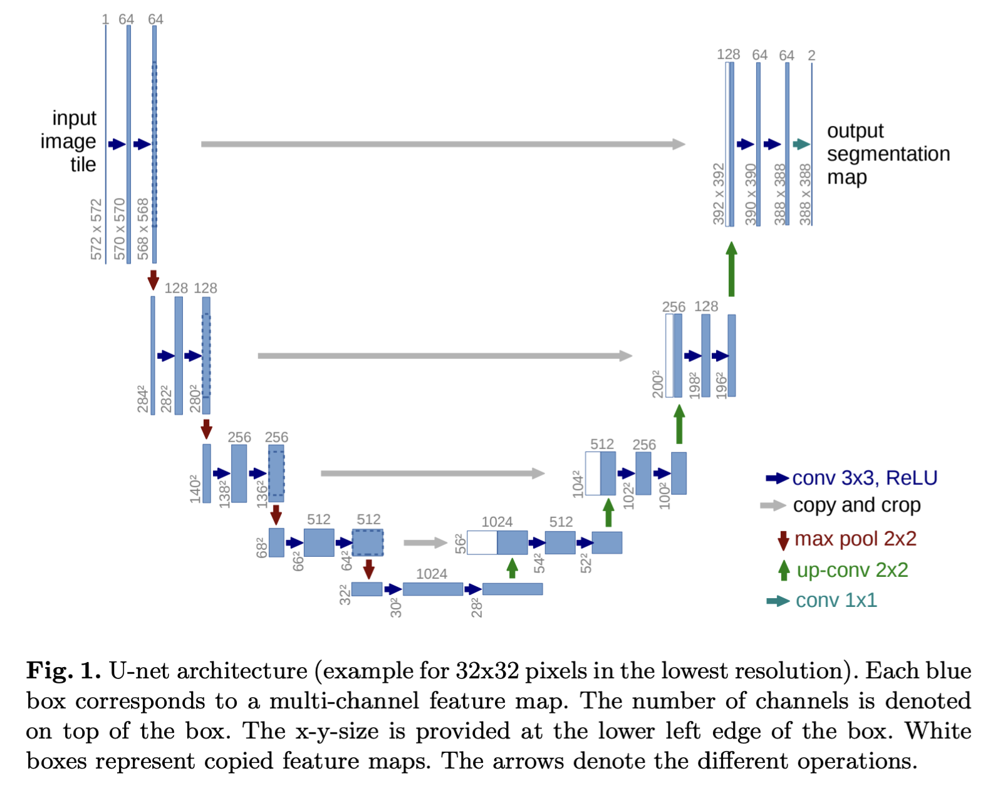
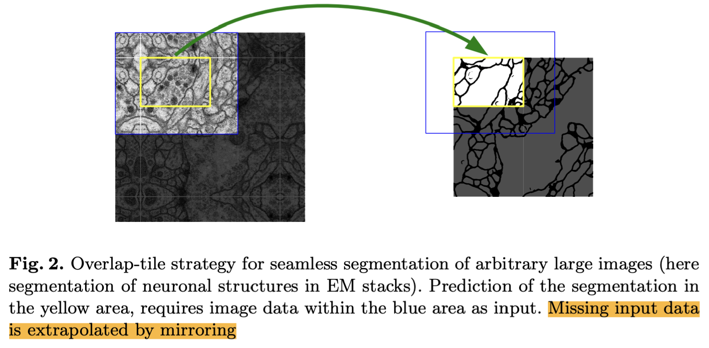
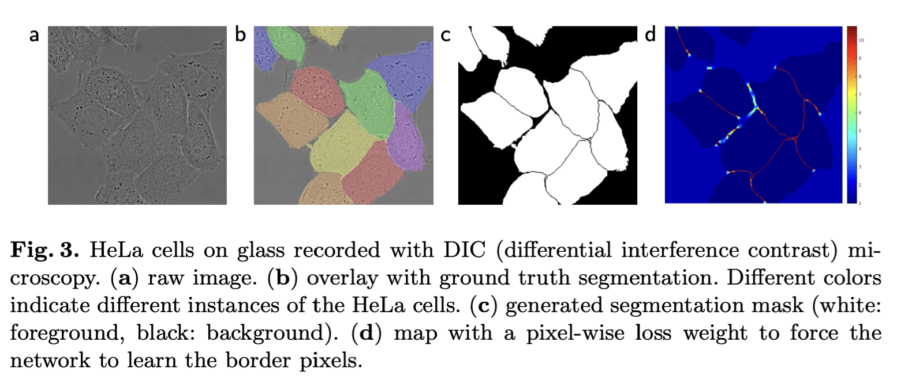
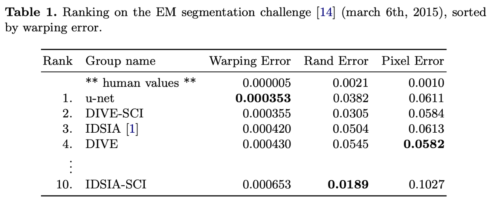
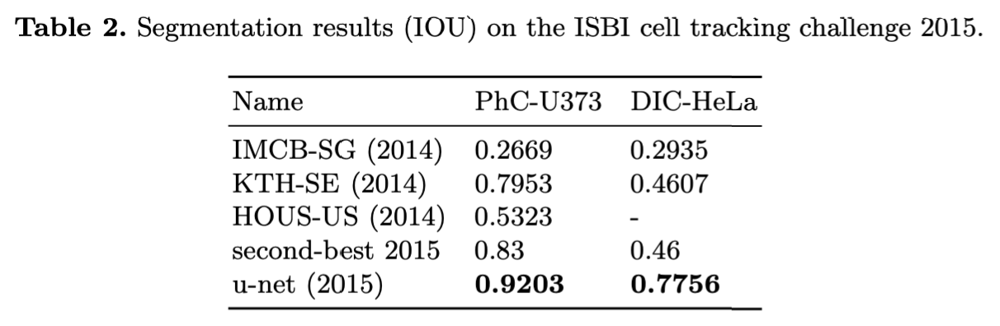

# U-Net Notes

## Abstract
- To use the available annotated samples more efficiently to train neural network.
- [ ] Initial contraction (Shrinking of image) - to capture context. How?
- [ ] Symmetrical Expansion (of image) - for localisation. How?
- Trained with very small images, but outperforms Sliding window technique.
    - [ ] Look how sliding window segmentation implemented.
- Faster than earlier methods (prior to 2015)

## What I infer from Figure 1

- There exist several blocks - where 2 convolution operation done on input and either downscaling(halving height and width, doubling channel) or upscaling operation(~ doubling height and width, halving channel)
    <!-- - But there is a difference in the way channel size is upscaled and downscaled.
    - In contraction, while maxpooling channel size remain same. Filter size then increased to change channel size.
    - In expansion, while upscaling operation is done the channel dimension is directly changed. and then once again halved by using filters. -->
- On each subsequent block the image size (or width and height) is reduced. But the width of channels increased (by using more number of filters in convolution)
- From the bottom, the input data is upscaled, and at each subsequent blocks the width of channels are subsequently decreased.
- While upscaling features extracted from *symmetrical* blocks are transferred(added) to the currently upscaled volume.
    - So the actual upscaled feature map is the sum of transferred feature map + up-convoled feature map from previous block.
- Upscaling is symmetrical to downscaling but the input dimensions are *not exactly* symmetrical before downscaling and after scaling. 

- Initial input size 572 by 572 image. Final output size 388 by 388. Only **2** output channels(masl)
    - [ ] Then how does all pixels are segmented?
        - Refer figure 2. "Missing input data
is extrapolated by mirroring" - but how?

## What I infer from Figure 2

- First image is input image, which has higher dimension (height, width) compared to output mapping.
- Second image is output to be overlapped with input image for segmenting.
- The whole pixels inside blue box is needed for segmenting the pixels in yellow box.
- [x] What is overlap tile strategy?
    - It is like sliding window strategy where large images (whose dimension doesn't fit the model's input dimension) are divided into fixed size overlapping windows/patches. And each patch is used one by one by the model.
    - Optimal tile size need to be selected. Overlapping regions in output should be carefully dealt with.

## What I infer from Figure 2

- a. Raw image
- b. Ground truth image for training
- c. Trained output mask, which when overlayed on input image gives the segmentation 
    - I guess Multiple masks are added (# of masks = # of class)
- d. Image of Proposed weight loss method that gives more preference to bakcground seperating two borders. Dark red represents more weight to thin border. Dark blue represents less weight.

## Introduction
- (Problem 1) - 
    - (Solution 1) -
- (Problem 2) - 
    - (Solution 2) -
- (Problem 3) -
    - (Solution 3) - 
- Contribution done in this paper
    - ...
- Read again

## Network Architecture
- **Left side** (Downsampling/Contracting path)
    - Typical CNN Architecture
    - 3 by 3 convolution of feature maps. Unpadded - so valid padding
        - Each followed by ReLU
    - Then 2 by 2 Max pooling with stride 2. - downsampling step.
    - Feature channels are doubled after downsampling step   
- **Right side** (Upsampling/Expanding path)
    - First upscaled (somehow done and seems like channel dim maintained) then 2 by 2 convolution done (up convolution, which halved feature channels dim). (But usually on convolution x,y size changes and channel size depends on filters used)
    - After halving, channel size is increased(or maintained from previous block) by concatenating corresponding **cropped** feature map from contraction path.
        - [ ] Why cropping needed?
    - Then 3 by 3 convolution followed by ReLU.
- Finally 1 by 1 convolution done (i.e filter size is 1 by 1 by 64 here). 2 classes, so two filter used.
- Total of 23 convolutions.
    - 8 **after** downsampling
    - 2 at bottom of architecture
    - 4 **while** upsampling
    - 8+1 = 9 **after** upsampling

## Training
- Stochastic Gradient used with Caffe.
> Remember: less the batch size, slower it takes to converge. But possibly reach a good minima with slow updation.
-  Here batch size is taken as 1 to reduce computational overhead. The authors favour **large input tiles** 
    - [ ] (WHY?)
- High momentum (0.99) used,
    - [ ] Revisit Momentum's mathematical concept.
- Final layer used  SoftMax along with Cross entopy loss function.
    - [ ] Revisit mathematics of Cross Entropy and its benifits.
- weight map is precomputed 
    - [ ]  Read the rest again
- Effective (random) Initilialisation of weights is very important to give equal preference to all parts of the network.   
    - [ ] Each feature map(weights?) Should have unit variance, why?
    - drawn from gaussian distribution of sqrt(2/N). N - filter size * number of feature channels. if 3 by 3 filer, 3 channel, then N = 9 * 3 = 27.
        - [ ] Understand the intuition
    
## Data Augmentation
- Performed to improve invariance(Model predicting proper resuts even after change in orientation, scaling, lighting of input image) and robustness(Accurate results even in presence of noisy or corrupted data).
- Specific to the application domain. Here biological cells based invariance and robustness is given importance needed. 
    - Invariance & variance to : shift, rotation,  deformations and gray value variations(change in intensity or brightness).
    - Especially **random elastic deformations**
        - [ ] Read again about how it is done.
- [ ] How does **Dropout layers** at end of contracting path perform implicit data augmentation?

## Experiments
- Experimented with three types of segmentation tasks
    1. segmentation of neuronal structures(30, 512 by 512 images).
    1. segmentation of Glioblastoma-astrocytoma U373 cells (35 partially annotated data).
    1. segmentation of HeLa cells(20 partially annotated data).
- [x] Why in first task IoU metric not used whereas in second and third task it is used?
    - Used for the sake of competition evaluation. Even IoU is popular, but to get a more wide understanding of model's performance in different aspects different metrics are used.
    - [ ] Intuitively Understand the importance of Rand, Pixel and warping error.
- Trained for **10 hours** in NVidia Titan GPU(6 GB)

- Results for task 1. 

- Results for task 2 and 3 with IoU

## Other Reading List
- [ ] What did *Krizhevsky et al* done as a break through ?
- [ ] Tradeoff in  contribution of *Ciresan et al*
    - Why does using max pooling on larger patches  affects localization accuracy?
    - Why does small patches allow  little context.
- [ ] Why does upsampling increases resolution of image?
